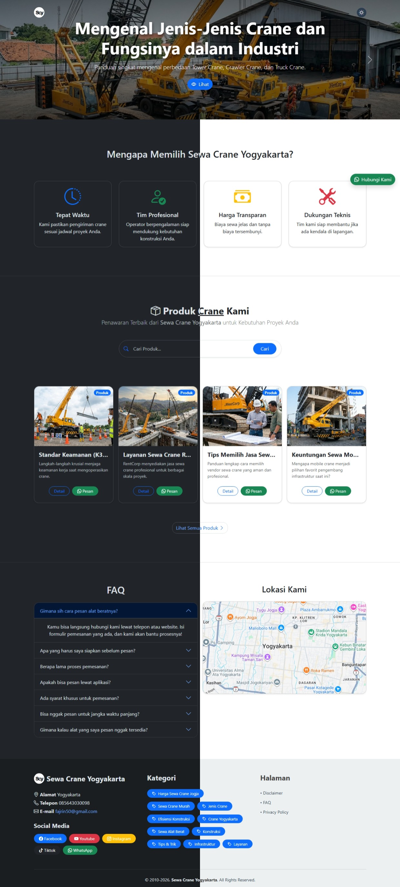

# Aiti Theme


Tema WordPress ringan, cepat, dan SEO-oriented untuk kebutuhan jasa rental alat berat (khususnya crane), dengan fokus pada Core Web Vitals, keamanan, dan konversi.

## Preview



## Fitur Utama

- Pemisahan konten **Produk** dan **Artikel** berbasis template post.
- Template **Product Detail** dengan CTA dan pesan WhatsApp siap pakai.
- Dukungan **Dark/Light mode**.
- Struktur SEO-friendly: heading hierarchy, performa cepat, dan data terstruktur.
- Optimasi performa: local assets, selective CSS loading, deferred JS.
- Dukungan media modern: **WebP** dan **AVIF**.
- Keamanan lebih ketat: AJAX search + Nonce + escaping output.
- Branding dinamis: inisial logo otomatis dari Site Title.
- Pengaturan bisnis langsung dari WordPress Settings.
- Responsive layout berbasis Bootstrap 5.3.2.

## Instalasi

1. Upload folder tema ke `/wp-content/themes/`.
2. Aktifkan tema lewat **Appearance -> Themes**.
3. Atur detail bisnis di **Settings -> General**.

## Konfigurasi Penting

Atur opsi berikut di **Settings -> General**:

- `company_address`: alamat perusahaan, juga dipakai untuk section peta.
- `company_phone`: nomor telepon untuk auto-generate link WhatsApp.
- `company_facebook`, `company_youtube`, `company_instagram`, `company_tiktok`: URL sosial media untuk footer.

### Menentukan Post sebagai Produk

1. Buka **Edit Post**.
2. Di **Post Attributes -> Template**, pilih **Product Detail**.
3. Post tanpa template ini akan tampil sebagai artikel biasa.

### FAQ Dinamis di Front Page

FAQ mengambil konten dari post berdasarkan ID di `front-page.php`:

```php
$privacy_post = get_post(54); // Ganti 54 dengan ID post FAQ kamu
```

### Lokasi Google Maps

Section lokasi membaca nilai dari `company_address`, jadi cukup isi alamat lengkap agar map menyesuaikan otomatis.

## FAQ Singkat

### Bagaimana cara ubah inisial logo?
Inisial logo dibuat otomatis dari **Site Title** di **Settings -> General**.

### Apakah tema ini support Gutenberg?
Ya. Tema tetap kompatibel dengan Gutenberg, dengan optimasi style agar tidak memberatkan performa.

## Changelog (Ringkas)

### 1.3.2
- Revisi SEO + Core Web Vitals.
- Peningkatan alur metadata dan ukuran turunan untuk upload WebP.
- Perbaikan responsive image (`srcset`/`sizes`) pada card.
- Penurunan risiko CLS pada hero.
- Preload hero image pertama untuk bantu LCP.
- Embed Google Maps dibuat click-to-load.
- Perbaikan FOUC terkait loading stylesheet.

### 1.3.1
- Perbaikan edge case thumbnail invisible (`width="1" height="1"`).
- Hardening rendering image di AJAX search.
- Redesain card konten terkait jadi horizontal.
- Logic pemisahan produk/artikel terkait diperjelas.

### 1.3.0
- Penambahan template **Product Detail**.
- Refactor homepage untuk pemisahan produk dan artikel.
- Integrasi pesan minat WhatsApp pada kartu produk.

## Lisensi

Aiti Theme didistribusikan dengan lisensi **GNU GPL v2 or later**.

---

## Donasi

### Donasi & Beli Kopi

Kalau AitiGo ngebantu kerjaanmu dan bikin hidup sedikit lebih waras,
boleh traktir kopi biar maintainer kuat begadang.

- [☕(saweria)](https://saweria.co/aitisolutions)
- [☕(Buymeacoffee)](https://buymeacoffee.com/aitisolutions)
- QRIS tersedia (Hubungi saya)
